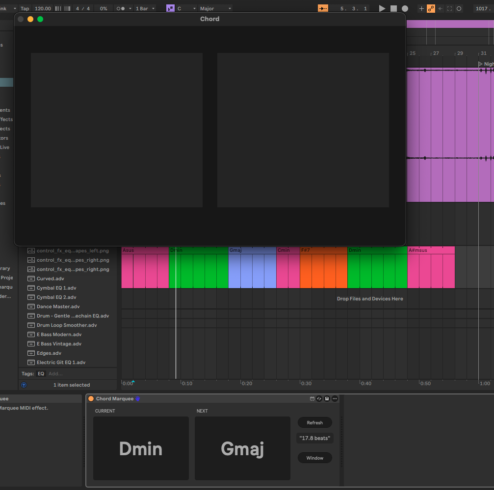

# Chord Marquee

Chord Marquee is a free Max for Live MIDI Effect that follows named clips on a
dedicated `CHORDS` track and displays the current chord, the next chord, and the
number of beats until the change.

## Features

- compact Current and Next displays in Live's Device View;
- a large, resizable floating window for practice and performance;
- automatic updates when chord clips are renamed, moved, resized, added, or
  removed;
- transport-aware playback, scrubbing, and position jumps;
- loop-aware Next display and countdown;
- a manual Refresh control for reconnecting if needed.

## Install

1. Download `Chord-Marquee-v0.1.0.zip` from the latest GitHub release.
2. Extract the ZIP.
3. Drag `Chord Marquee.amxd` onto a MIDI track in Ableton Live.
4. Create a MIDI track named `CHORDS` and add named Arrangement clips for the
   chord changes.
5. Press **Window** for the resizable performance view; press **Close** to hide
   it.

The release device is frozen and self-contained. No separate JavaScript files
are required.

## Development

1. Create a MIDI track named `CHORDS` in Arrangement View.
2. Add empty MIDI clips and name them with chord symbols.
3. Run `python3 tools/build_amxd.py "src/Chord Marquee.maxpat" "dist/Chord Marquee.amxd"`.
4. Keep the generated `.amxd` and JavaScript files together while testing.

The build script creates an unfrozen development device. Before publishing a
release, open it from Live with **Edit in Max**, click **Freeze Device**, and
save it. A frozen build contains `mdat` sections and works without sidecars.

## Requirements

- Ableton Live 12
- Max for Live (included with Live Suite, or available as an add-on for Live
  Standard)

## Version

Current release: **v0.1.0**. See [CHANGELOG.md](CHANGELOG.md) for release notes.

## License

Chord Marquee is released under the MIT License. See [LICENSE](LICENSE).
